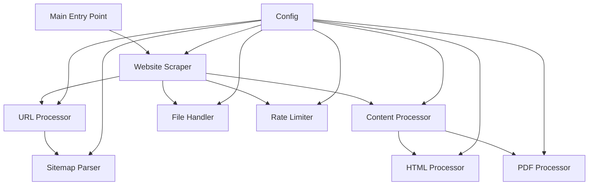

# Wormpy Development Guidelines and Architecture

## 1. Coding Guidelines

### 1.1 General Principles

- Follow PEP 8 conventions for code style.
- Write clear, concise, and self-documenting code.
- Prioritize readability and maintainability over clever optimizations.
- Use type hints to improve code clarity and catch potential errors early.
- Keep functions and methods focused on a single responsibility.
- Aim for high test coverage, especially for core functionality.

### 1.2 Documentation

- Provide docstrings for all modules, classes, and functions.
- Use Google-style docstrings for consistency.
- Include examples in docstrings where appropriate.
- Keep comments up-to-date with code changes.
- Document any non-obvious algorithms or optimizations.

### 1.3 Error Handling and Logging

- Use try-except blocks to handle expected exceptions.
- Log errors and warnings appropriately using the `logging` module.
- Provide context in error messages to aid debugging.
- Use different logging levels (DEBUG, INFO, WARNING, ERROR) appropriately.

### 1.4 Performance Considerations

- Use generators and lazy evaluation where possible to conserve memory.
- Implement caching mechanisms for frequently accessed data.
- Profile code regularly to identify and optimize bottlenecks.
- Consider using asyncio for I/O-bound operations to improve concurrency.

### 1.5 Scalability and Modularity

- Design new features as separate modules that integrate with the existing architecture.
- Use dependency injection to reduce coupling between components.
- Implement a plugin system for easy extension of functionality.
- Use configuration files to manage settings and allow for easy customization.

### 1.6 Version Control

- Use meaningful commit messages that explain the why, not just the what.
- Create feature branches for new developments.
- Regularly merge changes from the main branch to feature branches to reduce conflicts.
- Use pull requests for code reviews before merging into the main branch.

## 2. Architecture Overview

Wormpy is designed as a modular, extensible web scraping tool with a focus on performance and scalability. The architecture follows a layered approach with clear separation of concerns.

### 2.1 High-level System Design Diagram

### 2.2 Description of Major Components and Their Interactions

1. **Main Entry Point (`main.py`)**: Handles command-line arguments and initiates the scraping process.

2. **Website Scraper (`website_scraper.py`)**: Orchestrates the scraping process, managing URL discovery and content extraction.

3. **URL Processor (`url_processor.py`)**: Handles URL normalization, validation, and extraction from content.

4. **Content Processor (`content_processor.py`)**: Manages the extraction of text content from various sources (HTML, PDF).

5. **File Handler (`file_handler.py`)**: Manages file operations for saving scraped content.

6. **Sitemap Parser (`sitemap_parser.py`)**: Parses XML sitemaps to discover URLs.

7. **HTML Processor (part of `content_processor.py`)**: Extracts text content from HTML pages.

8. **PDF Processor (`pdf_processor.py`)**: Extracts text content from PDF files.

9. **Rate Limiter (part of `content_processor.py`)**: Manages request rates to respect server resources.

10. **Config (`config.py`)**: Centralizes configuration settings for the application.

### 2.3 Design Patterns Used

1. **Facade Pattern**: The `WebsiteScraper` class acts as a facade, providing a simplified interface to the complex subsystems of URL processing, content extraction, and file handling.

2. **Strategy Pattern**: Different content processing strategies (HTML, PDF) are encapsulated in separate classes, allowing for easy extension to new content types.

3. **Singleton Pattern**: The `RateLimiter` class is implemented as a singleton to ensure consistent rate limiting across the application.

4. **Factory Method Pattern**: Could be implemented for creating different types of processors based on content type.

5. **Observer Pattern**: Could be implemented to notify various components about the progress of the scraping process.

### 2.4 Proposed Enhancements for Scalability and Performance

1. **Asynchronous Processing**: Implement asyncio for concurrent URL fetching and processing.

2. **Distributed Scraping**: Develop a distributed architecture using message queues (e.g., RabbitMQ) to distribute scraping tasks across multiple workers.

3. **Caching Layer**: Implement a caching mechanism (e.g., Redis) to store frequently accessed data and reduce redundant network requests.

4. **Pipeline Architecture**: Refactor the scraping process into a series of independent stages (discovery, fetching, processing, storage) that can be scaled independently.

5. **Plugin System**: Develop a plugin architecture to allow easy addition of new content processors, URL discovery methods, and output formats.

6. **Adaptive Rate Limiting**: Enhance the rate limiter to dynamically adjust request rates based on server responses and configuration.

7. **Persistent Queue**: Implement a persistent queue system to allow pausing and resuming of long-running scraping tasks.

8. **Metrics and Monitoring**: Integrate a metrics collection system (e.g., Prometheus) for real-time monitoring of scraping performance and errors.

By following these guidelines and architectural principles, the Wormpy project can maintain high code quality, performance, and scalability as it grows and evolves. The modular design allows for easy extension and modification, making it well-suited for future enhancements and feature additions.

